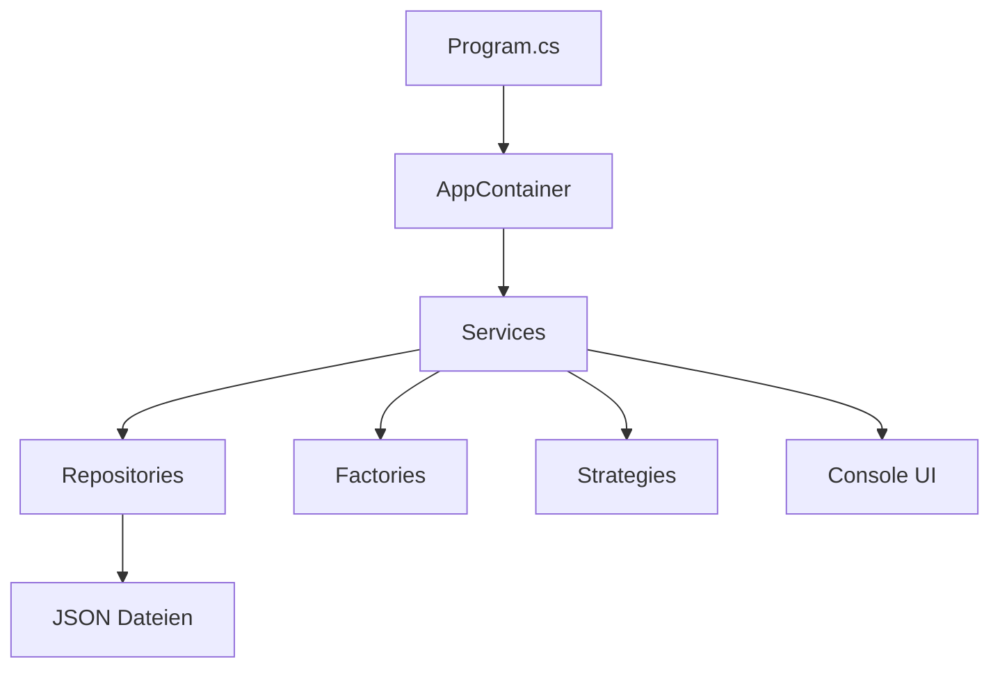

<div align="center">

# Slytherin Magical Intelligence System
### HausSlytherin_SMIS

<p>
  
  
  
  
</p>

Ein abgeschlossenes C#-Konsolenprojekt zur Verwaltung magischer Kreaturen, Vorfaelle,
Forscher und Risikoberichte im Stil einer modularen Hogwarts-Intelligence-Anwendung.

</div>

---

## Projektprofil

> Das Projekt zeigt OOP, Service Layer, Repository Pattern, Factory Pattern,
> Strategy Pattern und LINQ in einer zusammenhaengenden Fantasy-Domaene.

<table>
  <tr>
    <td width="33%">
      <h3>Verwaltung</h3>
      Kreaturen, Vorfaelle und Forscher werden ueber eine interaktive Konsole erfasst und organisiert.
    </td>
    <td width="33%">
      <h3>Analyse</h3>
      Risiken werden ueber austauschbare Strategien bewertet und als Reports zusammengefasst.
    </td>
    <td width="33%">
      <h3>Auswertung</h3>
      Statistiken liefern schnelle Einblicke in Gefahr, Aktivitaeten und Forschungsdaten.
    </td>
  </tr>
</table>

## Kernfunktionen

- Kreaturen anlegen, anzeigen und dauerhaft in JSON speichern
- Vorfaelle mit Datum, Schweregrad und Kreaturbezug erfassen
- Forscher mit Haus, Spezialisierung und Erfahrungslevel verwalten
- Risikoberichte mit drei unterschiedlichen Bewertungsstrategien erzeugen
- Statistiken zu Kreaturen, Vorfaellen, Forschern und Reports ausgeben
- Klare Trennung zwischen Modellen, Services, Repositories, Factories und Strategies

## Technologie

| Bereich | Umsetzung |
| --- | --- |
| Sprache | C# |
| Framework | .NET 8 |
| Anwendung | Konsolenanwendung |
| Persistenz | `creatures.json`, `incidents.json`, `researchers.json` |
| Architektur | Service Layer, Repository, Factory, Strategy |
| Auswertung | LINQ fuer Sortierung, Filter und Kennzahlen |

## Typischer Ablauf

```text
Kreatur anlegen
   -> Vorfall erfassen
   -> Risikostrategie waehlen
   -> Risikobericht generieren
   -> Reports und Statistiken auswerten
```

## Risikostrategien

| Strategie | Formel | Einsatzzweck |
| --- | --- | --- |
| `Standard` | `DangerLevel * 10 + Severity * 5` | ausgewogene Grundbewertung |
| `Streng` | `DangerLevel * 15 + Severity * 15 (+20 bei restricted)` | konservative Sicherheitsbewertung |
| `Forschung` | `DangerLevel * 8 + Severity * 4` | mildere Bewertung fuer Forschungsszenarien |

Die resultierenden Empfehlungen werden in vier Handlungsstufen uebersetzt:
`Beobachten`, `Vorsicht`, `Eingeschraenkter Zugang`, `Sofortiges Eingreifen`.

## Architekturueberblick



### Zentrale Bausteine

- `Program.cs` startet die Anwendung und uebergibt an den Menuefluss.
- `AppContainer.cs` erstellt und verbindet alle zentralen Komponenten.
- `Services/` enthaelt die Geschaeftslogik und Benutzerinteraktion.
- `Repositories/` kuemmert sich um Laden, Speichern und Abfragen.
- `Factories/` erzeugt Domaintypen kontrolliert und konsistent.
- `Strategies/` kapselt die austauschbaren Risikoalgorithmen.
- `Models/` beschreibt die Datenstrukturen des Systems.

## Projektstruktur

```text
HausSlytherin_SMIS
|-- Program.cs
|-- AppContainer.cs
|-- Models/
|-- Services/
|-- Repositories/
|-- Factories/
|-- Strategies/
|-- Interfaces/
|-- Enums/
|-- Exceptions/
|-- Logger/
|-- Docs/
`-- creatures.json
```

## Installation und Start

### Voraussetzungen

- .NET SDK 8.0

### Anwendung starten

```bash
dotnet build
dotnet run
```

Die Anwendung startet als interaktives Konsolenmenue.

## Empfohlener Nutzungsablauf

1. Eine oder mehrere Kreaturen anlegen.
2. Vorfaelle fuer bestehende Kreaturen erfassen.
3. Optional Forscher registrieren.
4. Einen Risikobericht fuer eine Kreatur und einen passenden Vorfall erzeugen.
5. Reports und Statistiken anzeigen.

## Persistenz

- Kreaturen werden in `creatures.json` gespeichert.
- Vorfaelle werden in `incidents.json` gespeichert.
- Forscher werden in `researchers.json` gespeichert.
- Risikoberichte bleiben aktuell nur waehrend der Laufzeit im Speicher.

## Dokumentation

- [Beitragsregeln](Docs/CONTRIBUTING.md)
- [Aufgabenstellung](Docs/Aufgabe_G2_HausSlytherin.pdf)

## Projektstatus

Dieses Projekt ist abgeschlossen und wird nicht weiterentwickelt.
Die README dokumentiert damit den finalen Stand des Systems.
 